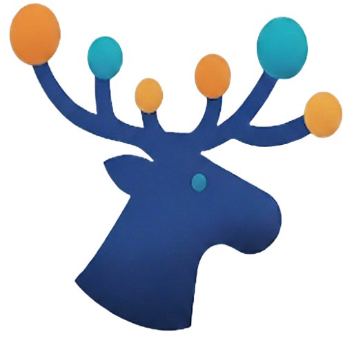

# Moose Antler

### Your Ideas, Amplified.

Moose Antler is a modern, **mind-mapping and visual brainstorming tool** designed for **students, writers, developers, and creative professionals**. It combines the intuitive structure of a classic mind map with a smart AI co-pilot, helping you to organize your thoughts, break through creative blocks, and turn good ideas into great ones.

Stop just staring at a blank page. Start building your next big idea.

---

## Your AI Co-Pilot, Not an Autopilot 🧠✨

We believe AI should be a scalpel, not a sledgehammer. Moose Antler gives you just enough AI to fuel your brainstorming, not replace it. Instead of asking a chatbot a vague question, click the AI icon on any idea to access surgical actions:

* **Expand Idea:** Generate a handful of related concepts to explore new avenues.
* **💡 Suggest Analogies:** Discover new ways to think about your topic.
* **⚖️ Play Devil's Advocate:** Uncover weaknesses and strengthen your arguments.
* **Summarize Branch:** Condense a complex branch into a clear, concise summary.

---

## Powerful Mind Mapping, Made Simple

At its core, Moose Antler is a robust and flexible tool for structuring information. A mindmapping experience focused on speed and ease of use, giving you everything you need to get your ideas down.

* ✅ **Intuitive Editing:** Quickly add, edit, and delete nodes with a clean, minimal interface.
* 🌳 **Collapsible Branches:** Effortlessly expand and collapse entire branches to focus on what matters and manage complexity.
* ↔️ **Flexible Layouts:** Instantly switch between vertical and horizontal tree layouts to visualize your map in the way that makes the most sense.

* 🖼️ **Rich Nodes:** Go beyond text. Add images to your nodes to create vibrant, visual mood boards and story maps.
* 🎨 **Customizable & Persistent:** With light/dark modes, custom color themes, and persistent settings, the app remembers your workflow, including your last-used file and zoom level.

---

## Core Features

* ✅ **Infinite Canvas:** A fluid, pannable, and zoomable canvas that grows with your ideas.
* 💾 **Private:** Your files and settings are saved locally on your device.
* 🔄 **Cloud Sync Ready:** Save your `.moose` files in any cloud-synced folder (like Google Drive or OneDrive) to seamlessly work across your devices.
* 📤 **Export to Markdown:** Easily export your mind maps to a structured Markdown file, complete with emoji prefixes for AI-generated ideas, ready to be used in any note-taking app or text editor.

---

## Use Cases & Examples

Moose Antler is a versatile tool for any project that starts with an idea.

### For Students & Researchers
Plan your next essay or research paper with unparalleled clarity.
* **Root Idea:** Your paper's thesis statement.
* **Expand Idea:** Generate the main supporting arguments for your thesis.
* **Play Devil's Advocate:** Instantly find potential counterarguments you need to address in your paper.
* **Summarize Branch:** Condense all the research under a specific topic into a concise topic sentence.

### For Creative Professionals
Outline a novel, design a user-flow, or build a world.
* **Root Idea:** The theme of your story or the core user problem.
* **Branches:** Create branches for characters, plot points, locations, or features.
* **Add Images:** Attach character sketches, location photos, or UI mockups directly to nodes to create a living mood board.
* **Suggest Analogies:** Break through a creative block by asking the AI for fresh metaphors and perspectives on a concept.

### For Productivity Enthusiasts
Map out a new business venture, plan a software project, or structure a presentation.
* **Root Idea:** Your project's main objective (e.g., "Launch New Website Q4").
* **Branches:** Break down the project into epics like "Design," "Development," and "Marketing."
* **Expand Idea:** Flesh out the "Marketing" branch with AI-suggested channels like "SEO Strategy," "Social Media Campaign," etc.
* **Export to Markdown:** Turn your entire project plan into a clean text document to share with your team.

---
## Getting Started

*(This section can be updated when you have a release)*

1.  Go to the [Releases Page](https://github.com/YourUsername/moose-antler/releases) (placeholder).
2.  Download the latest installer for your operating system.
3.  Run the app!

---
## Getting Around: How to Use Moose Antler

Moose Antler is designed to be fast and intuitive.

**Pan the Canvas**: Click and drag anywhere on the background to move your mind map around.

**Zoom**: Use your mouse scroll wheel or the zoom slider in the bottom-right corner.

**Expand/Collapse**: A single click on any node toggles the visibility of its children. A ... indicator will appear on a collapsed node if it has hidden children.

**Node Actions**:
- Click the left icon (⋮) on a node to open the standard actions menu (Add Child, Edit Text, Add Image, etc.).
- Click the right icon (✨) on a node to open the AI actions menu.
- Alternatively, a long-press on any node will also open the standard actions menu.
---
## Built With

* [Flutter](https://flutter.dev/) - The UI toolkit for building beautiful, natively compiled applications for mobile, web, and desktop from a single codebase.
* [Dart](https://dart.dev/) - The programming language used by Flutter.
* [Google Gemini API](https://ai.google.dev/) - The AI model powering the brainstorming features.

---
## License & Copyright

Copyright © 2025 Moose Apps & V Shah. All Rights Reserved.
You may not copy, modify, merge, publish, distribute, sublicense, and/or sell copies of the software without explicit written permission from the author. 
